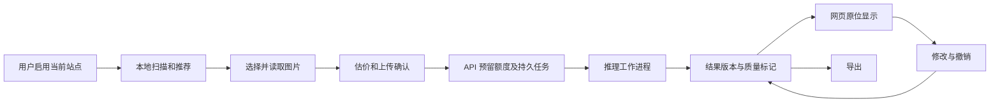

# 技术实施方案

文档编号：D04；版本：0.1；上游：[D03 研究](research.md)；需求依据：[D02](spec.md)。

## 上一份完整总结

D03 区分公开事实、设计假设与待验证项，列出检测、OCR、翻译、修复候选，并要求分别核实代码、权重、数据和字体授权。E-01～E-07 将验证取图、质量、成本和 Windows 运行环境；先小样本再固定质量集。真实站点、商业价格、模型效果与授权尚未确认。上游允许编写技术方案，不允许把候选组件宣称为已验证方案。

## 系统边界与暂定技术栈

| 部分 | 暂定方案 | 原因与替换边界 |
|---|---|---|
| 浏览器扩展 | Manifest V3、TypeScript、React 侧栏、Vite 构建 | 内容脚本保持轻量；工具版本 P01 固定 |
| API | Python 3.11 系列、FastAPI、版本化 HTTP 契约 | 便于对接视觉推理；具体版本按兼容实验锁定 |
| 推理工作进程 | Python，模型经统一适配器加载；适用时用 ONNX Runtime/PyTorch | CPU 开发回退，GPU 生产候选；不承诺 CPU 达到 GPU 延迟 |
| 任务与数据 | PostgreSQL 持久任务/账本，Redis 队列及限流 | 队列不是事实来源；事件丢失仍可从数据库恢复 |
| 对象存储 | 本地开发目录，生产 S3 兼容私有存储 | API 返回短效访问凭据；默认不提供公开桶 |
| 翻译 | 服务端文本模型适配器，受限区域可选视觉补救 | 密钥与服务商差异不进入插件 |
| 排版 | Python/Skia 候选渲染器，固定授权字体 | 掩膜、安全区和文字布局独立于渲染库 |
| 验证 | 单元/契约/集成测试、真实浏览器扩展测试、模型基准 | 普通网页模拟不能代替扩展权限与休眠测试 |

以上为 ASSUMPTION。P01 完成后写决策记录，锁定兼容版本与依赖；不直接使用浮动 `latest` 作为可复现构建依据。

## 建议代码组织

```text
apps/extension/          # 内容脚本、侧栏、后台、设置
services/api/            # 身份、图片提交、任务、账户、账本
services/worker/         # 检测、OCR、翻译、修复、排版
packages/contracts/     # 版本化 schema 与类型生成
tests/fixtures/         # 允许再分发的自有/合成页面和图片
tests/integration/      # 真数据库、任务、存储及服务适配器
tests/e2e/              # 安装扩展后的浏览器测试
benchmarks/             # 质量/性能脚本与脱敏清单
infra/                  # 本地开发与部署配置
scripts/                # Windows 友好启动、检查、构建
docs/                   # 治理、决策、使用和运维
reports/                # 阶段总结与脱敏验证证据
```

此结构是后续创建计划，当前不存在的目录不能在报告中写成已交付工程。

## 数据流



## 插件实现边界

1. 内容脚本发现图片、记录自然尺寸、当前源、DOM 身份和源变化代次；不在页面暴露账户 token 或服务商密钥。
2. 主动启用使用最小授权；常驻快捷点击需用户授予该站点持久访问，不能假定 `activeTab` 自动覆盖所有将来的页面。
3. 扩展侧负责图片读取，逐域申请需要的访问。CDN、防盗链、登录限制不能靠权限保证解决；不向后端转发浏览器 Cookie 或登录凭据。
4. 通信只允许明确动作与消息 schema，校验发件标签/帧与资源归属，禁止任意 URL 代理。CSS 背景图与 iframe 作为后续适配，不默认为全支持。
5. 覆盖优先采用隔离容器/译图层，保留原节点、可访问文本与原始状态。使用尺寸/变更观察器更新；仅对用户手势目标拦截事件，不全局截断网页交互。
6. 当前图片的源或代次变化时，先撤下旧覆盖，再匹配新身份；缓存 keyed by 图片内容和配置，不能仅以 DOM index 或文件名关联。
7. 扩展后台只做事件协调，任务 ID 等写入持久存储。重开侧栏后查询服务端恢复；完成结果需用户仍在相应页面才挂载。
8. 截图降级仅处理用户主动框选区域；标记 screenshot 来源、实际像素和低清限制。不能借截图绕过内容访问权限。

## 图像处理流水线

### 输入准备

校验实际解码格式、尺寸、像素量、压缩比和方向；拒绝损坏、动画、多帧和超预算输入。服务端计算哈希，去除无关元数据；保存原始尺寸和每个变换矩阵。

初始限制：单图编码不超过 20 MiB，解码不超过 40MP、单边不超过 60000px；批次不超过 100 张/200 标准页；均为 P01 待校准值。界面提前告知，后端再次检查。

### 检测和 OCR

统一检测输出文本与气泡候选，必要时用分割补充气泡边界。对于高分辨率和细注音使用分块/多尺度，不先缩成小图丢信息。区域归并保留振假名，并区分 OCR 正文归一化与清除注音的目标。

OCR 在实际文字裁剪上运行；记录区域类型、方向、文本和异常标记。空白、图案和艺术字不得通过 OCR 的臆测直接生成确定对白。阅读顺序结合页布局；无法判断时允许校对并保留区域映射。

### 翻译

按页组织带区域 ID 的正文、术语表和有限已读摘要。要求结构化返回，以 ID 对应，校验缺失、重复和长度。上下文预算明确截断，不无界附加整本漫画。批次阅读顺序确定后生成连续上下文；若某页失败，后页记录上下文缺口，不能无提示串错页。

用户漫画文字视为待翻译数据，不允许它驱动工具调用、读取密钥或改变系统指令。最多两次自动重试；视觉补救受额度上限和用户模式约束。相同任务请求需复用中间结果，不能重启全部流程增加成本。

### 掩膜、修复和嵌字

建立擦字掩膜，纳入注音/描边，扩张幅度与图像分辨率相关；气泡边界和背景线条作为保护条件。简单背景使用局部颜色填充，复杂区域只在掩膜内修复。拟声词、跨人物艺术字默认译注。

安全区由气泡内部或已批准文字区域计算，留出边距。排版决定断行、标点避头尾、字号、行距、颜色和描边；优先保证可读字号。装不下时生成 overflow 标记和可修正出口，不无限缩小。

输出原尺寸译图、结构化文字/坐标、可编辑布局和质量标记。第一次嵌字和后续编辑走同一渲染器，导出不截图网页，避免缩放损失和页面样式污染。

### 长图

按高度切块并保留重叠边缘，区域映射回原图；重叠区域按文本和位置合并，跨边界文字重新裁剪识别，页上下文保持顺序。超出可安全解码预算时拒绝或要求分图，不能靠分块绕过输入资源限制。超导出尺寸使用有序分段并显式说明。

## 任务、缓存与计费

API 先持久化任务和额度预留，再通过事务 outbox 投递。工作进程领取租约/心跳，超时回收，按至少一次交付设计；状态变化和结算必须幂等。worker 重启不等于任务新建。

缓存先限制用户内部：输入哈希、语言、模式、检测/OCR/翻译/修复/字体版本、术语表和上下文摘要哈希组成键。只改字号复用 OCR/译文；更换正文/术语后生成新结果版本。P01 不实施跨用户共享。

任务服务是持久状态来源，Redis 不单独持有余额；账本用数据库事务保证余额、预留和流水一致。支付回调验签并根据事件 ID 去重；网络支付成功不凭浏览器跳转认定。

## 开发和生产运行

Windows 使用明确的 PowerShell 启动/检查脚本，服务配置示例无真实密钥；可以选择已安装的 Docker Desktop 或本机数据库，但不能静默安装大型系统依赖。端口、模型下载目录、GPU/CPU 路径可配置。

生产可采用 Linux 容器和 GPU worker，文档区分用户开发主机与服务器环境。P06 确认实际部署目标，才编写对应的可执行生产操作；默认不购买机器。

## 本份完整总结

- 已确定：轻量扩展＋持久 API/队列＋可替换推理 worker 的边界，原图/区域/覆盖分层。
- 已设计：获取、检测、OCR、上下文、掩膜、修复、排版、长图、缓存、额度和故障恢复。
- 暂定：技术栈、上传上限和硬件；P01 需实测锁定，不代表已经安装运行。
- 遗留风险：站点取图、低清艺术字、资源预算、授权，均有实验和降级出口。
- 下一份输入：模块边界、坐标变换、持久状态与幂等需求。
- 结论：可以执行下一步，编写 D05 数据模型；只放行文档编写。
